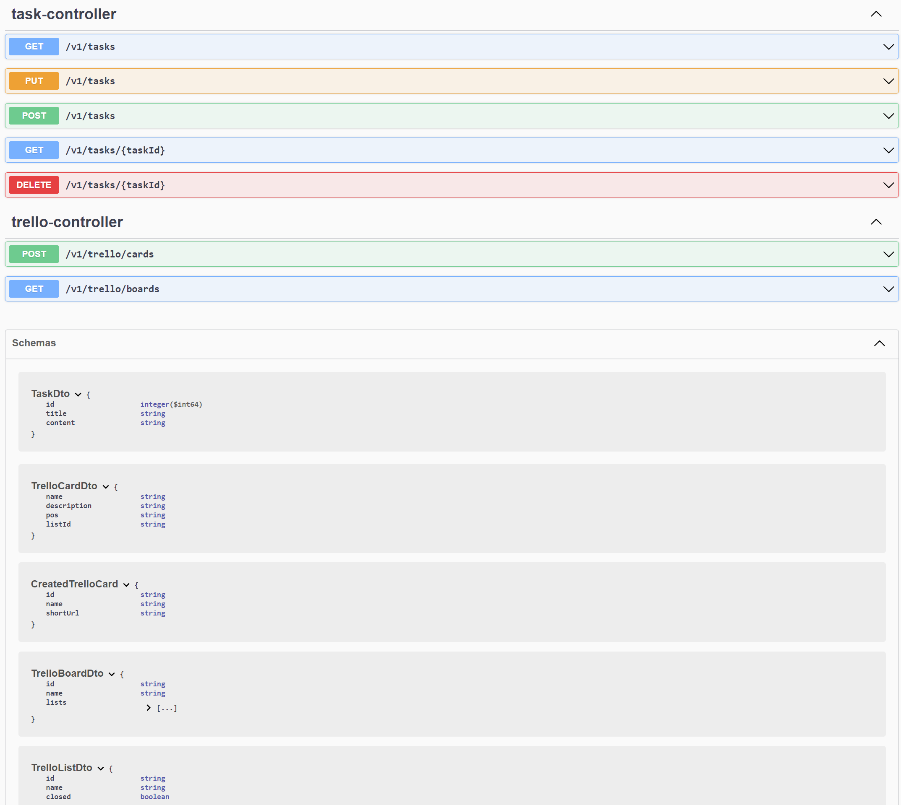

Welcome in my TASKS project.

This is simple CRUD application. The main purpose of this project was to play a little bit with Spring and Hibernate frameworks,
learn how to design architecture for simple REST web service,
learn how to write REST Controller classes and how to send HTTP requests in Java code.

In my application I use MySQL database.
This application is build with Spring framework, and Hibernate.
For better transparency I used Lombok library. 
My application support HTTP methods: GET, POST, PUT and DELETE.
I also implemented Scheduler and Swagger.

In this application we can create tasks. If we want, we can export tasks to Trello
using Trello API. The application has implemented e-mail support.
When the task is exported to Trello, we will receive an e-mail notification.

  
 
 

 
 
 

Author: GG

